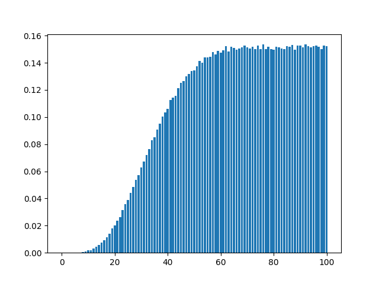

# Flip Poker

## Fixed strategy (random prob)

- For some constant `p`
- For each game, pick a set of cards using `p` to choose/not choose the card

### Results

- Picking more cards tended to do better. The highest win rate occurred around 100%.
- Picking all cards (essentially 5 cards vs 8 cards) resulted in ~15% win rate.

Graph of win-rate vs p-value:
l

## Fixed strategy (with random walk)

- Randomly initialize some fixed strategy
- Flip a random card and test it for X number of iterations
- If the new fixed strategy has better win rate, set it to be the current one
- Repeat this process

### Results

- Found fixed strategy with win rate of ~29%
  - Search parameters: GAMES_PER_STEP=10000
  - [(4, 0), (4, 1), (4, 2), (4, 3), (8, 0), (8, 1), (8, 2), (8, 3), (9, 1), (9, 2), (9, 3), (10, 0), (10, 1), (10, 2), (10, 3), (11, 0), (11, 1), (11, 2), (11, 3), (12, 0), (12, 1), (12, 2), (12, 3)]
  - All A/K/Q/J/T/6
- Can get stuck at extremely poor strategy (maybe due to a very lucky run for a very bad strategy)

## Fixed strategy (with heuristic search)
